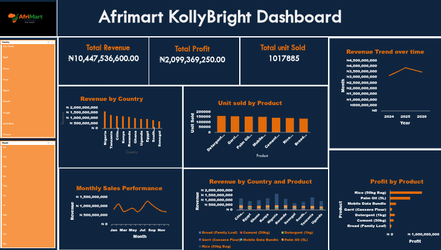

# AfriMart_KollyBright_Sales_Dashboard

## Project Overview
This project was done using Excel worksheet. Pivot tables, charts and dashboard was created to analyze and track sales performance across countries and products.
This project was created as part of a data analysis portfolio to demonstrate skills in Excel data summarization and dashboard design for displaying meaningful insights

---

## Business Questions answered

- What is the total revenue generated by AfriMart between 2024 and 2026?
- What is the total unit of products sold?
- What is the total profit made?
- Which product generate the highest profit?
- Which product sells the most?
- Which countries generate the highest revenue?
- How does revenue change over time (monthly/yearly)?

---

## Key KPIs
Total Revenue
Total Units Sold
Total Profit

---
## Tools Used
- Microsoft Excel
- Pivot Tables
- Pivot Charts
- Slicers
- Dashboard Design Technique

---

## Dashboard Preview

## Key Insights
- Nigeria generates the highest percentage of the total revenue.
- Revenue trends show consistent growth over time.
- Some products recorded high sales volume but lower profit margin.
- Product performance vary significantly by country.

---
## Files in this repository
- [Sales dataset](AfriMart_Sales_Dataset_1.xlsx)
- [Dashboard screenshot](Afrimart_KollyBright_Dashboard.png)
- README.md

---
## Conclusion
This project shows how raw sales data can be transformed into clear, interactive dashboards providing meaningful insights that supports data-driven business decisions. It highlights strong Excel fundamentals, critical thinking, and professional project documentation.

